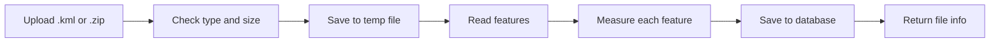

# Geospatial File Measurement API

A backend service that accepts a geospatial file (a zipped Shapefile or a
KML file), reads the features inside it, and returns their measurements:
area for polygons and length for lines.

- Built with **FastAPI**, **SQLAlchemy**, **GeoPandas / Shapely / PyProj**
- Stores results in SQLite (default) or PostgreSQL
- Measures in **meters**, never in degrees (see [CRS handling](#crs-handling))
- One bad feature never fails the whole file

## Setup

### Requirements

- Python 3.11 or newer (3.12 recommended)
- Docker (optional, for the PostgreSQL setup)

### Run locally (SQLite)

```bash
python -m venv .venv
source .venv/bin/activate        # Windows: .venv\Scripts\activate
pip install -r requirements.txt
uvicorn app.main:app --reload
```

The API runs at http://127.0.0.1:8000 and the interactive docs are at
http://127.0.0.1:8000/docs. By default, data is stored in a local
`geo.db` SQLite file.

### Run with Docker (PostgreSQL)

```bash
docker compose up --build
```

This starts the API and a PostgreSQL database. Data is kept in a Docker
volume. Stop with `docker compose down` (add `-v` to erase the data).

### Configuration

| Setting | Default | Meaning |
|---|---|---|
| `DATABASE_URL` | `sqlite:///./geo.db` | Any SQLAlchemy database URL |

The upload limits (50 MB upload, 200 MB unpacked) are constants in
`app/config.py`. The passwords in `docker-compose.yml` are for local use
only.

## API

Interactive docs are available at http://127.0.0.1:8000/docs while the
server is running.

### 1. Upload a file

`POST /api/files/`

Accepts a `.kml` file or a `.zip` containing one Shapefile. The file is
processed right away.

```bash
curl -X POST http://127.0.0.1:8000/api/files/ -F "file=@tests/data/square.kml"
```

On Windows PowerShell, use `curl.exe` instead of `curl`.

Response `201 Created`:

```json
{
  "id": "870fc184-2632-45e7-b53a-a66da1f50c2b",
  "filename": "square.kml",
  "feature_count": 1,
  "crs": "EPSG:4326",
  "status": "COMPLETED",
  "error_message": null,
  "created_at": "2026-10-09T10:15:30.123456Z"
}
```

### 2. Get file information

`GET /api/files/{id}/`

```bash
curl http://127.0.0.1:8000/api/files/870fc184-2632-45e7-b53a-a66da1f50c2b/
```

Returns the same JSON as the upload response.

### 3. Get measurements

`GET /api/files/{id}/measurements/`

Optional query parameters: `limit` (default 1000, max 5000) and `offset`
(default 0), for paging through large files.

```bash
curl "http://127.0.0.1:8000/api/files/870fc184-2632-45e7-b53a-a66da1f50c2b/measurements/"
```

Response `200 OK` (properties shortened here):

```json
{
  "file_id": "870fc184-2632-45e7-b53a-a66da1f50c2b",
  "crs": "EPSG:4326",
  "feature_count": 1,
  "limit": 1000,
  "offset": 0,
  "summary": {"measured": 1, "no_measurement": 0, "errors": 0},
  "features": [
    {
      "index": 0,
      "geometry_type": "Polygon",
      "geometry": {
        "type": "Polygon",
        "coordinates": [[[77.59, 12.97, 0], [77.6, 12.97, 0], [77.6, 12.98, 0],
                         [77.59, 12.98, 0], [77.59, 12.97, 0]]]
      },
      "crs": "EPSG:4326",
      "properties": {"Name": "Test Square", "description": null},
      "measurement": {
        "type": "area",
        "value": 1201683.9190970361,
        "unit": "m2",
        "crs_used": "EPSG:32643"
      },
      "error": null
    }
  ]
}
```

- `measurement` is `null` for points (no measurement is needed) and for
  features that failed.
- A failed feature has an `error` message. The other features in the
  file are still measured.
- `summary` counts the whole file, even when `limit` and `offset` show
  only some of the features.

### Error responses

A file that can't be read (here, a fake zip) returns `422`:

```json
{
  "detail": "The file is not a valid zip archive.",
  "id": "4c1d9a52-0b3e-4f7a-9d61-2e8b7a5c3f10",
  "status": "FAILED"
}
```

Other errors return `{"detail": "..."}`, for example:

```json
{"detail": "File not found."}
```

### Status codes

| Situation | Code |
|---|---|
| Success | `201` |
| Wrong file extension or no file name | `400` |
| File too large (over 50 MB) | `413` |
| File can't be read (bad zip, no CRS, and so on) | `422` |
| Unknown file id | `404` |
| Measurements asked for a file that is not `COMPLETED` | `409` |
| Unexpected server error | `500` |

## Architecture

### Application structure

```
app/
  main.py             creates the app, connects the router, creates tables on startup
  config.py           settings and limits
  database.py         database connection and sessions
  models.py           database tables (UploadedFile, Feature)
  schemas.py          shapes of the JSON responses
  api/files.py        the three endpoints
  services/
    file_reader.py    reads KML and zipped Shapefiles
    crs.py            picks the UTM zone, converts to EPSG:4326
    measurement.py    calculates area and length
    processing.py     connects the reader, the measurement and the database
scripts/
  compare_geodesic.py checks the UTM result against a geodesic calculation
tests/                automated tests
Dockerfile, docker-compose.yml
```

The endpoints only handle HTTP. The work happens in `services/`, which
doesn't know about HTTP. That makes the logic easy to test on its own.

### File-processing flow



1. The client sends the file to `POST /api/files/`.
2. The API checks the extension, cleans the file name, and saves the
   upload to a temporary file while checking the size limit.
3. A database record is created with status `PROCESSING`.
4. The file is read. A zip must contain exactly one Shapefile with its
   `.shp`, `.shx` and `.dbf` parts, and the file must have a CRS.
5. Each feature is measured (see below).
6. The features are saved and the file is marked `COMPLETED`. If the file
   can't be read, it is marked `FAILED` with the reason, and the API
   answers `422`.
7. The temporary file is always deleted.

### Measurement calculation flow

1. Check the geometry type. Polygons give an area, lines give a length,
   points need no measurement, and anything else gets an
   "unsupported geometry" error.
2. Empty or invalid geometry (for example, a polygon that crosses itself)
   gets an error message for that feature only.
3. If the geometry is not in EPSG:4326, convert it to EPSG:4326.
4. Pick the UTM zone of the feature's center point.
5. Project the geometry into that zone, which uses meters.
6. Calculate the area (m²) or length (m) and save the CRS that was used.

### CRS handling

Latitude and longitude are angles, measured in degrees. The distance
covered by one degree changes with the place on earth, so area and length
can't be calculated from degrees directly. As an example, a 0.01° square
near Bengaluru has an "area" of about 0.0001 when calculated in degrees,
while its real area is about 1.2 million m².

For every feature, the service:

1. Converts the geometry to EPSG:4326 (if it is not already in it).
2. Finds the feature's center point (centroid).
3. Picks the UTM zone for that point (EPSG:326xx for the northern
   hemisphere, EPSG:327xx for the southern).
4. Projects the geometry into that zone and measures it in meters.

The CRS that was used is returned with every measurement (`crs_used`).

## Design Decisions

| Decision | Why | Alternative considered |
|---|---|---|
| UTM zone chosen per feature | Accurate for local shapes, simple to explain, and works when a file has shapes in different places | One UTM zone for the whole file; an equal-area projection; geodesic calculation with `pyproj.Geod` |
| Reject files with no CRS | Guessing could silently give wrong numbers | Assume EPSG:4326 |
| Process the file during the upload request | Simple, and fine for the 50 MB limit | Background worker (Celery or RQ) |
| Store measurements at upload time | Reading them later is a simple query | Recalculate on every request |
| Feature properties stored as JSON | Attribute names differ from file to file | Fixed columns |
| Errors stored per feature | One bad feature should not fail the whole file | Fail the whole file |
| Read the zip in place, without unpacking | Avoids "zip slip" attacks | Extract to disk |
| SQLite by default, PostgreSQL by setting | Easy to start, ready for production | PostgreSQL only |

### Measured accuracy

The 0.01° × 0.01° square near Bengaluru from the tests:

- UTM area (this service): 1,201,683.92 m²
- Geodesic area (`pyproj.Geod`): 1,200,289.84 m²
- Difference: 0.1161%

The small difference is expected. UTM stretches distances slightly as you
move away from the center line of the zone. The check can be repeated
with `python -m scripts.compare_geodesic`.

### File handling

- Supported uploads: a `.zip` containing one Shapefile, or a `.kml` file.
- A zip with more than one Shapefile is rejected (one upload is one
  dataset).
- The zip is read in place and never unpacked to disk. The total
  unpacked size is also limited, to protect against zip bombs.
- For KML files, all layers (folders) are read and combined.
- The file name is reduced to its base name, and the temporary file gets
  a random name.

### Database

- SQLAlchemy with SQLite by default. Set `DATABASE_URL` to use PostgreSQL
  (or any other supported database) with no code changes.
- One row per feature. A failed feature stores its own error message.
- Geometry is stored as GeoJSON in the file's original CRS, with the CRS
  stored next to it.
- Tables are created on startup, for simplicity.

### Request processing and error handling

- Files are processed synchronously. The endpoints are plain `def`
  functions, so FastAPI runs them in a worker thread and one slow upload
  doesn't block other requests.
- For very large files, processing would move to a background worker. The
  `status` field (PROCESSING, COMPLETED, FAILED) is already in place.
- A file that can't be read is saved with status `FAILED` and the reason.
- A single bad feature (empty, invalid or unsupported geometry, or an
  unexpected error while measuring) gets its own error message. The rest
  of the file is still processed.
- Measurements are paged because a file may contain thousands of
  features.

### Docker

- The image uses `python:3.12-slim`. The geospatial libraries come as
  prebuilt wheels that include GDAL, PROJ and GEOS, so no system packages
  are needed.
- Dependencies are installed before the code is copied, so rebuilds are
  fast.
- The container runs as a non-root user and has a health check on
  `/health`.
- `docker-compose.yml` waits for PostgreSQL to be healthy before starting
  the API.

### Known limitations

- A very large feature that crosses several UTM zones is measured with
  the zone of its center point only, so the result is slightly less
  accurate.
- Invalid geometries are reported, not repaired.
- Height (Z) values are ignored.
- The upload size is checked while the upload is read. In production, a
  reverse proxy such as nginx should also limit the request size.
- Tables are created on startup instead of with database migrations.

## Testing

Install the requirements, then run from the project root:

```bash
pytest -v
```

The tests use an in-memory SQLite database, so the real `geo.db` is
never touched. Each test starts with a clean database.

| File | What it covers |
|---|---|
| `tests/test_crs.py` | UTM zone selection and conversion to EPSG:4326 |
| `tests/test_measurement.py` | Area and length, compared with geodesic results; errors for bad geometry |
| `tests/test_file_reader.py` | Reading KML and zipped Shapefiles; rejecting bad files |
| `tests/test_models.py` | Database tables, defaults, ordering and cascade delete |
| `tests/test_api.py` | The full API: upload, file info, measurements, paging, validation, error cases and cleanup |

Important cases tested: a bad feature doesn't stop the rest of the file
(both for invalid geometry and for an unexpected crash while measuring),
a file with no CRS is rejected, and temporary files are always deleted.

## Learning

- I learned why area can't be calculated from
  latitude and longitude, and how a projected CRS such as UTM fixes it.
- I learned how UTM zones work and how to pick one from a coordinate.
- I checked my own results against an independent method (geodesic
  calculation) instead of trusting them.
- I learned how to design for partial failure: one bad feature is
  reported but does not stop the others.
- I learned how to handle uploads safely (size limits, zip checks, clean
  file names, temporary file cleanup).
- I learned to test the full API with a test client, swap in a test
  database, and force failures on purpose with `monkeypatch`.
- I learned to package a Python app with GDAL-based libraries in Docker
  and run it with PostgreSQL.

## Future Scope

- Background processing with Celery or RQ (with Redis) for very large
  files. The `status` field is already in place for this.
- List and delete endpoints for uploaded files.
- Authentication, so each user only sees their own files.
- Database migrations with Alembic.
- PostgreSQL with PostGIS for spatial queries.
- Better accuracy for features that cross UTM zones (equal-area
  projection or geodesic measurement).
- Repair invalid geometries with `make_valid` instead of only reporting
  them.
- Accept zips with several Shapefiles, and let the user supply a CRS for
  a Shapefile that has no `.prj`.
- More input formats, such as GeoJSON.
- A multi-stage Docker build, and separate development and production
  requirements.

## Notes

I used an AI assistant (Claude) while building this project. I reviewed
the code, ran the tests, and can explain every part of it.